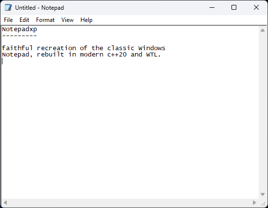

# NotepadXP

**A faithful recreation of the classic Windows Notepad, rebuilt in modern C++20.**

NotepadXP is a single-binary Windows text editor that recreates the classic (pre-Windows 11) Notepad — its features, dialogs, strings, and non-themed 3D look — running natively on Windows 11.

Built as a lightweight alternative to the modern Notepad, which has grown tabs, Copilot, and other weight. NotepadXP brings back the instant, focused single-file editor on a clean C++20 / WTL codebase: `ANSI / UTF-8 / UTF-16` encoding detection, `Find & Replace`, `Go To`, `Word Wrap`, `font selection`, `printing with headers/footers`, and a `live Ln/Col status bar` — plus quality-of-life touches the original lacked, like `multi-level undo/redo` and `Ctrl+Backspace` word delete.

## Quick Start
```cmd
notepadxp.exe                 # start with an empty document
notepadxp.exe notes.txt       # open a file
notepadxp.exe /A notes.txt    # open, forcing ANSI encoding
notepadxp.exe /W notes.txt    # open, forcing Unicode (UTF-16)
```

#### WTL GUI

